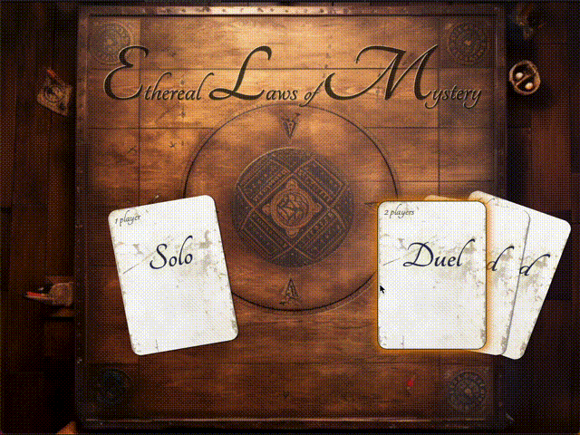

## Etheral Laws of Mystery

This is an exploration on how to write a round based, multipliplayer game with **Rust** in the backend
and **Elm** in the frontend.

❗Disclaimer: 100% prototype, not cleaned up code ❗

The architecture is heavily inspired by the design goals of [Lambdera](https://dashboard.lamdera.app/docs):

The central interface are two message types ([ToFrontend](https://github.com/axelerator/ethereal-laws-of-mystery/blob/main/src/app.rs#L22) and 
[ToBackend](https://github.com/axelerator/ethereal-laws-of-mystery/blob/main/src/app.rs#L22)) that are exchanged between front- and backend.

The [elm_rs crate](https://crates.io/crates/elm_rs/0.2.1) makes it so we only have to declare the types in "Rust land" and the application writes
out **Elm types and Json serializers** when run.

Play here: https://ethereal-laws-of-mystery.axelerator.de

Hit me (@axelerator) up on the [Elm Slack](https://elmlang.slack.com/) if you want to chat!
